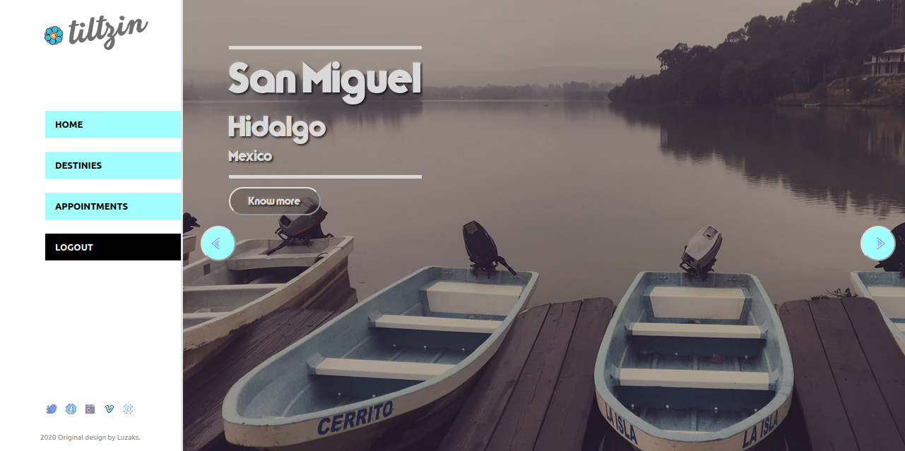

# :hibiscus: Tiltzin - Final Capstone Project :hibiscus:

[<p align="center">Live Version</p>](https://tiltzin.herokuapp.com/)

## 📝 Table of Contents

* [About the Project](#-about-the-project)
  * [Tiltzin](#-tiltzin)
    * [Landing](#-landing)
    * [Dashboard](#-dashboard)
    * [What to expect in the future](#-what-to-expect-in-the-future)
* [Getting Started](#-getting-started)
* [Available Scripts](#-available-scripts)
* [Built With](#built-with)
* [Contact](#contact)
* [Acknowledgements](#acknowledgements)

<!-- ABOUT THE PROJECT -->
## 👉 About The Project

This is the Final Capstone Project for Microverse Complete Technical Curriculum. The implementation was completely built with  React, using the [Create React App](https://github.com/facebook/create-react-app) command, and with Redux architecture, for managing the internal state of the applicacion.

The purpose of the project is to follow industry standards and present a complete application for booking appointments with the given design and requirements for its behaviour. As well we should choose a nice to have requirement, for Tiltzin I choose to work on transitions for making the user experience better, and in general, I worked in the front end design, as well as in the user authentication.
In order to achieve all of this we should implement the best practices learned throught the program.

The complete project's assignment can be seen [here](https://www.notion.so/Final-Capstone-Project-Book-an-Appointment-41ded2ee99ff4fe4becf91acb332ca26).

The link for the back end repository can be found [here](https://github.com/Luzaks/tiltzin-api).

## 👉 Tiltzin

Tiltzin is an applications por medium screens and large screens, it's layout works up 650px, it tries to be a tourism agency but wants to be something more, its an application that allows you to connect with indigenous and ethnic people in order to be a responsible traveller, and/or tourist, with the natural environment and culture of the desired destiny, you can reserve a day for meeting and a family that belongs to the culture heritage of the area will be responsible of the lead activies booked for that destiny.

The style and desgin of the page was made thinking in the colors that represents the imaginery of indigenous ethnic groups of people in Mexico, but at the same time, it mix a much more modern approach in order to make it attractive to the eye.

### 👉 Landing Page

In Tiltztin you need to sign up or sign in the same as you regularly do it in normal applications, a form will be displayed if you click on the Sign in or in Sign up link in the navigation bar of the landing page.

    
<div align="center"></div>

<div align="center"></div>


### 👉 Tiltzin Dashboard

After joining in Tiltzin you'll se the dashboard with different pages that you can click on.

You'll be received with the Home page, with a welcome message and instructions for navigating throught the dashboard.


<div align="center"></div>


If you click the the destinies button, all the destinies registered in Tiltzin will be display in a slider, you can go to the left or the right as you please, looking at the photographs of our destinies.


<div align="center"></div>


By clicking in the know more button of every destiny you can see the details of the activies and reserve a day for the activities.


<div align="center"></div>


In the achievements section all the reserved days from all of the users will be displayed.


<div align="center"></div>


### What to expect in the future

Right now, as is it made, Tiltzin lacks of a sessions proper storage due to a problem with the domain name, you have to sign in everytime you reload the page, this problem will be fixed in the future, once the domain is available.

The same problem persists in the appointments sections, once the problem with the sessions is resolved, the appointments will be filtered only for the current user that logged in.

## Getting started

*   Click on the green button, in the repository. 
*   Add the following commands in your favorite bash:
```
git clone [copied text]
cd [repo name]
npm i
npm start
```

A tab will be opened in your default browser.

## Available Scripts

In the project directory, you can run, in your favorite bash:

1.- For activate the web-server watcher `./bin/webpack-dev-server`

2.- For starting the web-server `npm start`

3.- For installing dependencies `npm i`

4.- Outside the web-server, for running tests `npm test`

For running the app in the development mode after following the steps number 2 and 3.<br />
Open [http://localhost:3000](http://localhost:3000) to view it in the browser.


### 🛠 Built With

*   React.js 
*   Redux
*   Redux Dev Tools
*   React-Router-Dom
*   Axios
*   JSX
*   Styled Components
*   Prop-Types
*   CSS
*   Heroku
*   ES6
*   npm
*   Eslint

<!-- CONTACT & SUPPORT -->
## Contact & Support

🙍 Guadalupe Rangel - kanemekanik@gmail.com - ☄

You liked it? ⭐️ Star the project!!!

Any comment that you want to send I'll be happy to receive it.

## Acknowledgments

[Microverse](https://www.microverse.org/)

This project is for learning purposes. I don't own any image presented here.
